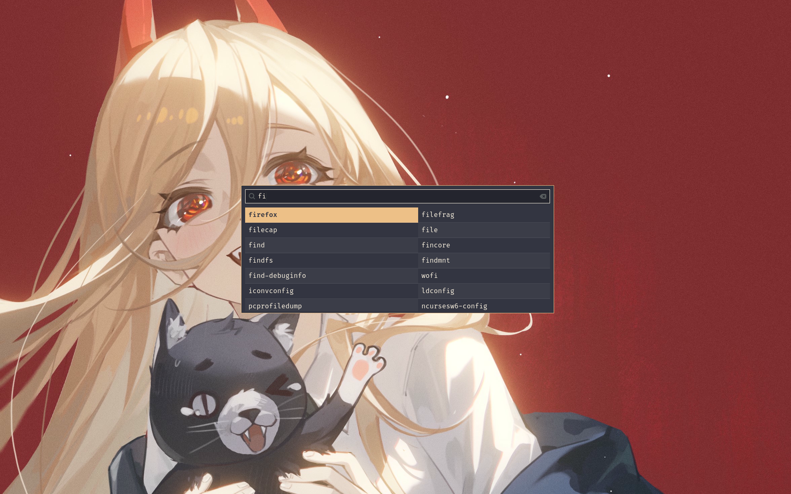

# Themes of Chainsaw Man for Wofi
Welcome! As a fan of the anime **Chainsaw Man**, I have designed a theme inspired by the character Power for the Wofi application launcher. **I hope you enjoy it as much as I do!**

## Preview
<details>
<summary>Yellow Power</summary>

</details>

## Installation

### Method 1
> [!IMPORTANT]
> If you have a *config* file located at `~/.config/wofi/`, it must be deleted or moved to a different directory.

1. Clone the repository:

    ```bash
    $ git clone https://github.com/SirOogway/wofi-chainsawman-themes.git
    ```

2. Move the **contents** of the `wofi-chainsawman-themes/` directory to the Wofi configuration directory:

    ```bash
    $ mv wofi-chainsawman-themes/* ~/.config/wofi/
    ```

3. **Enjoy this theme for Wofi!**

### Method 2
> [!NOTE]
> You need to make a small modification to the configuration file of the window manager you are using. With this method, you can keep any Wofi configuration files you have created.

1. Clone the repository:

    ```bash
    $ git clone https://github.com/SirOogway/wofi-chainsawman-themes.git
    ```

2. Move the `wofi-chainsawman-themes/` directory to the Wofi configuration directory:

    ```bash
    $ mv wofi-chainsawman-themes/ ~/.config/wofi/
    ```

3. Modify your window manager's configuration file to run Wofi with a configuration file located at a custom path.

    For example:

    1. Open your window manager's configuration (in my case, I use Hyprland):

        ```bash
        $ nvim ~/.config/hypr/hyprland.conf
        ```

    2. Assign the following code snippet to the variable `menu`:
        ```bash
        $ $menu = wofi --conf ~/.config/wofi/wofi-chainsawman-themes/config # We tell Wofi which configuration file to use
        ```

4. **Enjoy this theme for Wofi!**

## Wallpapers
I have included some wallpapers in `/assets/wallpapers/` that you can combine with your Wofi themes. **Choose the one you like best!**

## Cleanup
You can delete the `README.md` files as follows:

  ```bash
  $ rm README.md
  ```

If you don't want to keep the included wallpapers, you can remove the corresponding folder with the following command:

  ```bash
  $ rm -r assets/wallpapers/
  ```